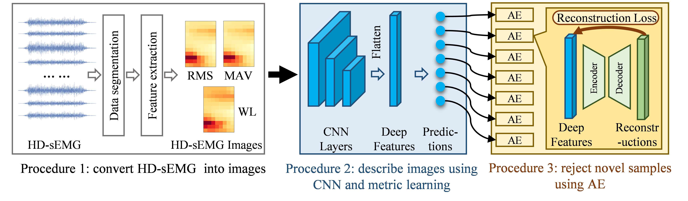
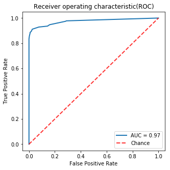
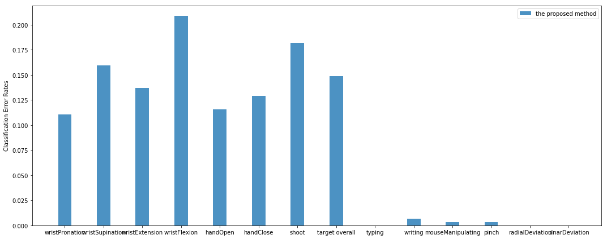

# Metric learning for novel motion rejection in high-density myoelectric pattern recognition

By [Le Wu](https://github.com/wule1994), Xu Zhang, Xuan Zhang, [Xiang Chen](https://scholar.google.com/citations?hl=en&user=JURnq4QAAAAJ), [Xun Chen](http://staff.ustc.edu.cn/~xunchen/index.htm)

This document contains tutorial for running the codes associated with the method reported in the paper entitled "Metric learning for novel motion rejection in high-density myoelectric pattern recognition", whcih has been accepted by Knowledge-Based Systems. You can refer to "https://www.sciencedirect.com/science/article/abs/pii/S0950705121004287" for the published paper.

## Abstrct
  
Most traditional myoelectric pattern recognition systems can only identify limited patterns and are prone to be disturbed by unknown motion tasks. This paper is aimed to develop a robust myoelectric control method towards rejecting novel/unknown patterns. In the proposed method, we first convert high-density surface electromyogram (HD-sEMG) signals into a series of feature images. Next, a metric-learning guided convolutional neural network (CNN) is utilized to extract discriminative representations of the images. Compared to separable representations from common CNN, discriminative property characterizes representations in both the compact intra-class variations and separable inter-class differences. Subsequently, we train multiple autoencoders (AEs) to reject representations from any novel pattern that appeared significantly different from target patterns. The performance of the proposed method was evaluated using HD-sEMG signals recorded by two pieces of flexible 68 high-density electrode array placed over forearm extensors and flexors of nine subjects during performing seven target motion tasks and six complicated novel motion tasks. The proposed method can identify and reject novel patterns with high accuracy of 94.28%, which is significantly better than a widely adopted traditional method of 77.49% (p < 0.05). This work demonstrated the validity of applying metric learning in alleviating novel motion interference, which is inevitable in myoelectric control. This work will enhance the robustness of myoelectric control systems.

## License

The repository is released under the MIT License.

## Installing dependencies
The code is developed based on the Keras framwork.  
**Keras (version: 2.2.4)**: we use tensorflow backend. The Keras installation and introduction are available at [`https://keras.io/`](https://keras.io/).  
**tensorflow (version: 1.13.1)**: tensorflow installation instructions are available at [`https://www.tensorflow.org/`](https://www.tensorflow.org/).

## Demonstration with an exemplary dataset
This is a demo when running our codes on an exemplary dataset, which can also be publicly downloaded via the same link as the source codes. Here are step-by-step instructions from downloading both the source codes and the data to result display: 

###Preparation
Download the data folder [(link)](https://drive.google.com/file/d/1qkge1sTHsDvGeVF7hTrZAFDyyumjTWKZ/view?usp=sharing), this folder contains HD-sEMG data from target and novel motions.  
Download the model folder [(link)](https://drive.google.com/file/d/1NMcXZnf9Upb1wKMSz0_9lZmChSo6059l/view?usp=sharing), this folder includes some pretrained models.   
For more details, you can referring to the corresponding code files or leave a message in the issue.

###Result display 
To obtain the results, you need to run the 'noveltyRejection_metricLearning.ipynb' file, which contains all codes and descriptions. The file also prints ROC curve, as well as classification error rate of each motions.

 
 